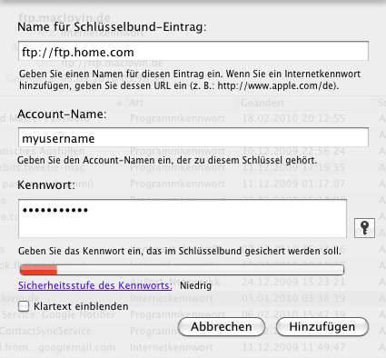

# Access OSX key chain

At everyday scripting, you often need to access sensible information
like passwords. A common practice is to just write them plain text into
your script, but at least on a Mac, we can do better.

OS X ships with a
tool called keychain. It is a central database where tools can store
sensitive information like logins. Luckily, it is accessible from shell
scripts with the command line utility **security**.

Let's say you want
to securely access an FTP server's username and password. First of all,
add a new Internet password to your keychain. To do so, just fire it up,
select *New password* and enter the credentials. Remember to add the
prefix http:// or ftp:// to your service name to create an Internet
password.



Now you read the username like this from the command line

```bash
security find-internet-password -s ftp.home.com | grep "acct" | cut -d '"' -f 4
```

The service is what you entered in keychain, but without the prefix. And
finally your password

```bash
security 2>&1 >/dev/null find-internet-password -gs ftp.home.com -w
```

That's all. No more plain text passwords in your script.